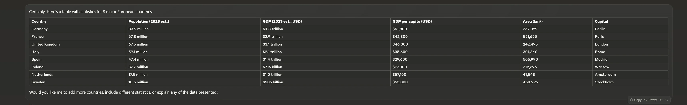

# Wider Claude.ai Chat

Wider Claude.ai Chat is a Greasemonkey user script that increases the maximum width of the central window on [Claude.ai](https://claude.ai) to make conversations more readable and accessible.

## Before

## After

## Installation

1. Install a browser extension that supports user scripts, such as [Greasemonkey](https://www.greasespot.net/).
2. Go to the script page on [GitHub](https://github.com/PierpaoloSpadafora/wider-claude-ai-chat).
3. Click on "Raw" to view the content of the script.
4. The user script extension should automatically detect the script and offer you the option to install it (otherwise copy and paste the code in a new User Script).
5. Reload the page and the central window should have increased its maximum width. 

## Contributions

If the css changes or the script stops working and you want to contribute to fixing it, you are welcome.

## License

This project is distributed under the MIT license. See the [LICENSE](LICENSE) file for more details.

## Contact

Author: Pierpaolo Spadafora  
Homepage: [GitHub](https://github.com/PierpaoloSpadafora/)  
Website: [https://www.pierpaolospadafora.com](https://www.pierpaolospadafora.com)
